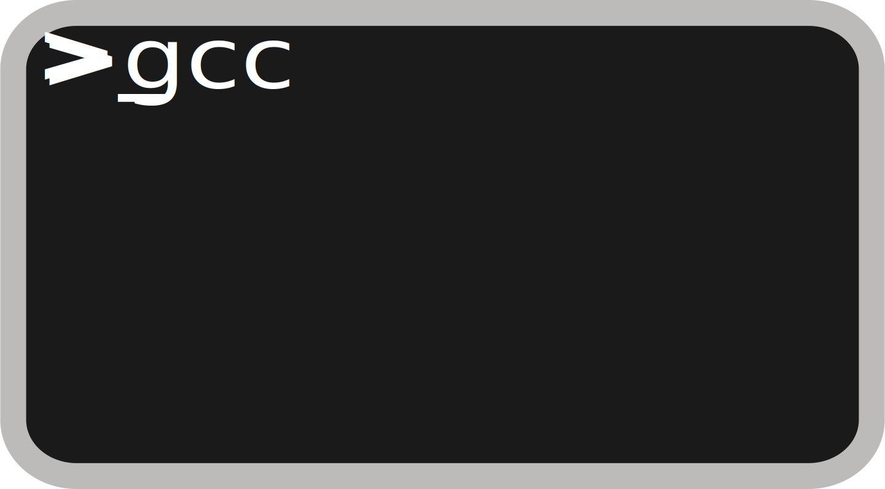

# De-0-a-C-Developer

Un libro para aprender a programar iniciando con el lenguaje **C** usando sistemas **Linux** y ser capaces de contribuir o crear proyectos **Open Source** que ocupen este lenguaje.

Este lenguaje es usado en proyectos como:

* **Gnome**.
* **Linux Kernel**.
* **Gnu**
* **Hurd Kernel**
* **Xfce**
* **Lxde**
* **Vim**
* **The Gimp**
* **Inkscape**
* **Audacity**
* **Vlc**
* **Postfix**
* Entre muchos mas ...

Y si aun permaneces escéptico pueden verificar directamente buscando el codigo fuente de cada proyecto.

> **Bienvenido a lo bonito.**

